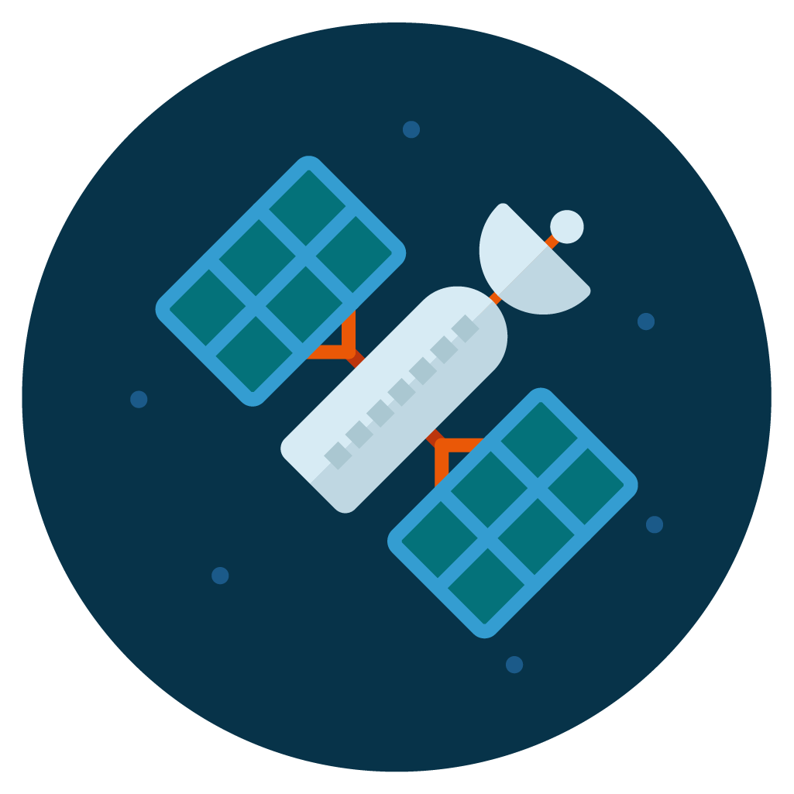

# Geolocation Service




Geolocation service for operations with addresses and GPS coordinates. There is a docker compose for both the geolocation service and Grafana Loki for logs, as well as Jaeger for traces.

## Start geolocation

```shell
docker compose -f docker/geolocation/docker-compose.yml up -d
```

This will also start Jaeger for traces, and the Grafana stack for easy observability. Once the Grafana stack is fully running, you can access the web UI at http://localhost:3000. The default username/password is admin/admin.

## Stop geolocation:

```shell
docker compose -f docker/geolocation/docker-compose.yml down
```

## Curl examples

Request GPS coordinates for an address:

```shell
curl -v -X POST http://localhost:8080/api/coords -d '{"street": "123 Anywhere St.", "city": "New York", "state": "NY"}'
```

Create a new address:

```shell
curl -v -X POST http://localhost:8080/api/coords/new -d '{"id": 3, "street": "123 Anywhere St.", "city": "New York", "state": "NY", "coords": { "lat": 10, "lon": 10 } }'
```
